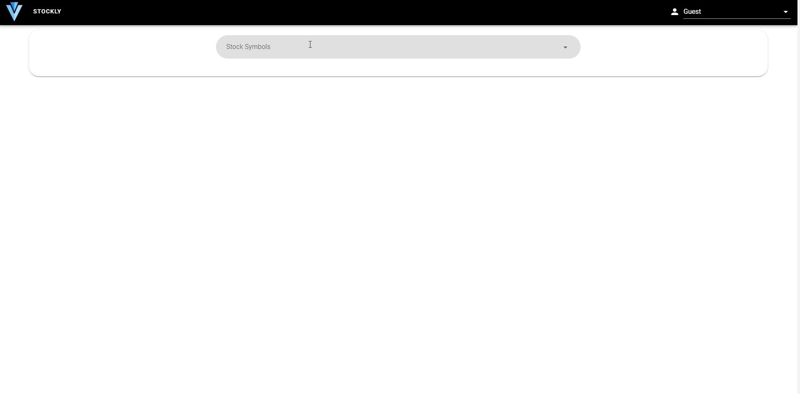

# Stock Market Site

  

## Project Details

Simple stock price checker site. Developed with Vue, Vuetify and D3.js . You can check your favorite stock's price daily, weekly and monthly. Site uses Alphavantage API for stock information.

## Project Demo

<center><a style="font-size:24px" href="https://stock-market-site.vercel.app/"> 🌌 Project Demo</a></center>


## Project setup

```

npm install

```

  

### Compiles and hot-reloads for development

```

npm run serve

```

  

### Compiles and minifies for production

```

npm run build

```